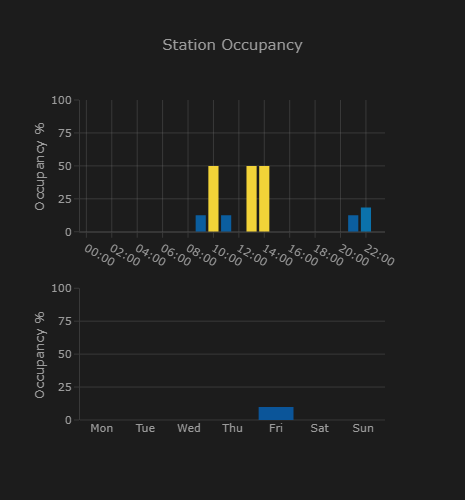

# SmartCharge - EV Charging Station Monitor

[](https://my.home-assistant.io/redirect/hacs_repository/?owner=iandresari&repository=smartcharge&category=integration)

A Home Assistant integration for monitoring EnBW electric vehicle charging stations in Germany.

## Features

- **Easy Configuration**: Search nearby stations on a map or enter a station ID directly — one config entry per station
- **Custom Friendly Name**: Set a custom static part of the sensor's friendly name during setup or reconfiguration. By default, this uses the EVSE code (e.g. `MVV`) and station number (e.g. `MVV_station_829151`).
- **Single Entity per Station**: One sensor per station showing `available` or `occupied`, with a dynamic name like `2 / 5 - StationName`. For stations with more than 9 charge points, the available count is spaced (e.g. `1 0 / 10 - StationName`).
- **Charge Point Details**: Every charge point's status, power, and connector type exposed as entity attributes
- **Occupancy Tracking**: Persistent occupancy histograms by hour-of-day and weekday, accumulating over time and surviving restarts
- **Map Integration**: GPS coordinates as attributes so the sensor appears on the HA map
- **Location Data**: GPS coordinates and address as attributes on each station sensor

## Installation

### HACS (Recommended)

1. Click the badge above, or go to HACS → Integrations → search for "SmartCharge"
2. Install the integration
3. Restart Home Assistant

### Manual

1. Download the integration files into your `custom_components` directory:
   ```
   custom_components/smartcharge/
   ```
2. Restart Home Assistant

## Configuration

1. Go to Settings → Devices & Services
2. Click "Add Integration"
3. Search for "SmartCharge"
4. Choose **Search Nearby Stations** (recommended) to find stations on a map, or enter a station ID manually
5. If searching: drag the map pin to your area, adjust the radius, then pick a station from the results
6. Configure the update interval (60–3600 seconds, default 300)
7. Optionally set a custom static part of the friendly name. If left blank, the default is the EVSE code and station number (e.g. `MVV_station_829151`).

To monitor multiple stations, add the integration once per station.

## Getting Station IDs (Manual Fallback)

If you prefer to enter a station ID directly, you can find it using your browser's developer tools:

1. Open the [EnBW charging map](https://www.enbw.com/elektromobilitaet/produkte/mobilityplus-app/ladestation-finden/map)
2. Open your browser's developer tools:
   - **Chrome**: Press `F12` or `Ctrl+Shift+I`, then go to the **Network** tab
   - **Firefox**: Press `F12` or `Ctrl+Shift+I`, then go to the **Network** tab
3. Click on a charging station on the map
4. In the Network tab, look for a request to the EnBW API, e.g.:
   ```
   https://enbw-emp.azure-api.net/emobility-public-api/api/v1/chargestations/134057
   ```
5. The number at the end of the URL (e.g. `134057`) is the **station ID**

> **Tip**: You can also find the API subscription key in the request headers under `Ocp-Apim-Subscription-Key` if you want to set a manual key in the integration options.

## Entities

Each config entry (one per station) creates a single sensor. You can reconfigure the integration at any time via the Home Assistant UI (Options):

### Station Availability Sensor

- **State**: `available` (at least one charge point is free) or `occupied` (all charge points in use)
- **Dynamic Name**: Updates to show availability, e.g. `2 / 5 - Hauptstraße 10, Stuttgart`. For stations with more than 9 charge points, the available count is spaced (e.g. `1 0 / 10 - StationName`).
- **Icon**: Switches between `mdi:ev-station` and `mdi:ev-station-unavailable`

### Attributes

- `total_charge_points`: Total number of charge points at the station
- `available_count`: Number of currently available charge points
- `occupied_count`: Number of currently occupied charge points
- `latitude` / `longitude`: GPS coordinates (enables map display)
- `address`: Physical address
- **Per charge point** (keyed by EVSE ID): Status, power in kW, and connector type, e.g. `available | 50 kW | CCS`
- `occupancy_weekday`: Average occupancy % by day of week (accumulated over time)
- `occupancy_hourly`: Average occupancy % by hour of day (accumulated over time)

## Dashboard: Occupancy Histograms with Plotly Graph Card

You can visualize the occupancy data as color-coded bar charts using the [Plotly Graph Card](https://github.com/dbuezas/lovelace-plotly-graph-card) (install via HACS → Frontend).



```yaml
type: custom:plotly-graph
raw_plotly_config: true
defaults:
  entity:
    type: bar
    showlegend: false
    marker:
      colorscale: Portland
      cmin: 0
      cmax: 100
  xaxes:
    type: category
    showgrid: true
  yaxes:
    range: [0, 100]
    title: Occupancy %
    dtick: 25
    showgrid: true
entities:
  - entity: &station sensor.YOUR_STATION_availability
    name: Hourly
    x: $ex Object.keys(meta.occupancy_hourly || {})
    "y": $ex Object.values(meta.occupancy_hourly || {})
    marker:
      color: $ex Object.values(meta.occupancy_hourly || {})
  - entity: *station
    name: Weekly
    x: $ex Object.keys(meta.occupancy_weekday || {})
    "y": $ex Object.values(meta.occupancy_weekday || {})
    xaxis: x2
    yaxis: y2
    marker:
      color: $ex Object.values(meta.occupancy_weekday || {})
layout:
  title: Station Occupancy
  height: 500
  grid:
    rows: 2
    columns: 1
    subplots: [[xy], [x2y2]]
    roworder: top to bottom
  xaxis:
    dtick: 2
```

> **Note**: Replace `sensor.YOUR_STATION_availability` with your actual station entity ID. The YAML anchor (`&station` / `*station`) ensures the entity is defined only once. The `meta` variable provides direct access to the entity's attributes. Bar colors follow a continuous gradient (Portland colorscale) from low (blue) to high (red) occupancy. Other built-in colorscales: `Jet`, `RdYlGn_r`, `YlOrRd`, `Viridis` — see [Plotly colorscales](https://plotly.com/javascript/colorscales/).

## Service Calls

### Refresh Data

```yaml
service: smartcharge.refresh_data
```

## Automations Example

### Notify when a charge point becomes available

```yaml
automation:
  - alias: "Notify when charging station available"
    trigger:
      platform: state
      entity_id: sensor.my_station_availability
      to: "available"
    action:
      - service: notify.mobile_app_phone
        data:
          title: "Charging Station Available"
          message: >
            {{ state_attr('sensor.my_station_availability', 'available_count') }}
            charge point(s) now free!
```

## Troubleshooting

### No entities created

- Check that your station ID is correct on the EnBW map
- Verify internet connectivity
- Review Home Assistant logs for errors (`custom_components.smartcharge`)

### Data not updating

- Check the update interval setting in the integration options
- Verify the API is accessible
- Restart the integration

## Development

For community discussions:
- [EnBW Charging Community Thread](https://community.home-assistant.io/t/status-of-enbw-charging-stations/409573)

## License

MIT License - See LICENSE file for details

## Support

For issues and feature requests, please [open an issue](https://github.com/iandresari/smartcharge/issues).
